Fit app
=======

Fit app was build mainly with SpoonacularAPI, front-end was done using React library, React router and Redux and back-end with Node.js (server-side) and PostgreSQL database. I used some other features like bootstrap, highcharts, AOS for animation, heropatterns and also EmailJS
. Website was build based on Tailwind template. 

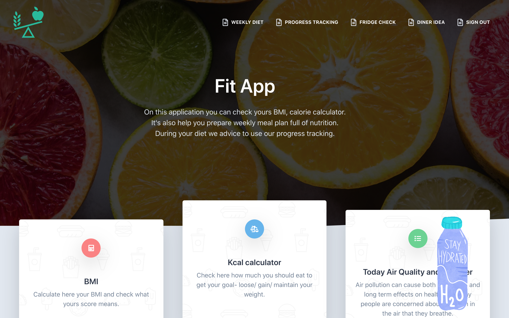

Landing page (when user is not sign in) client can find:
* BMI (body mass calculator) after clicking on component there is pop up where user can do calculation after filling form

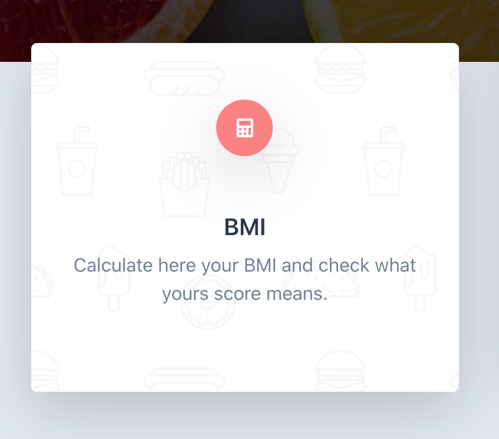
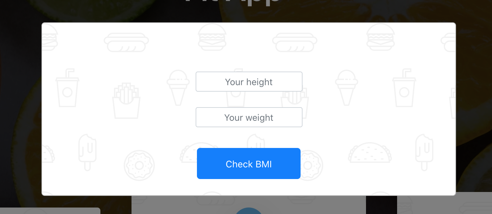
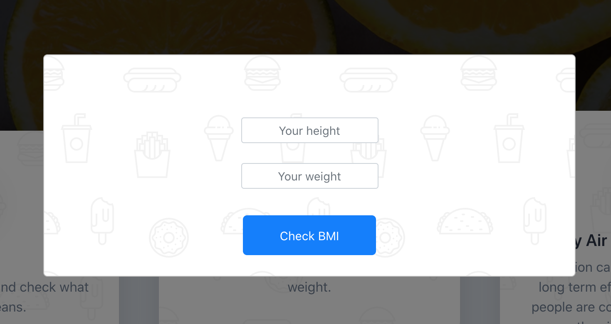

* There is similar component to check required caloric intake- also pop up after click on component and form that needs to be fill on to get calculation (its giving 2 different parameters- base caloric intake and full daily one based on active level of user)

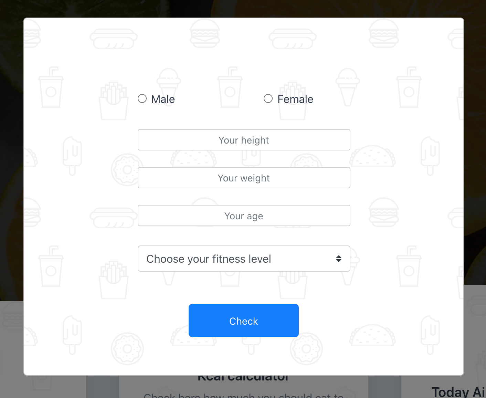

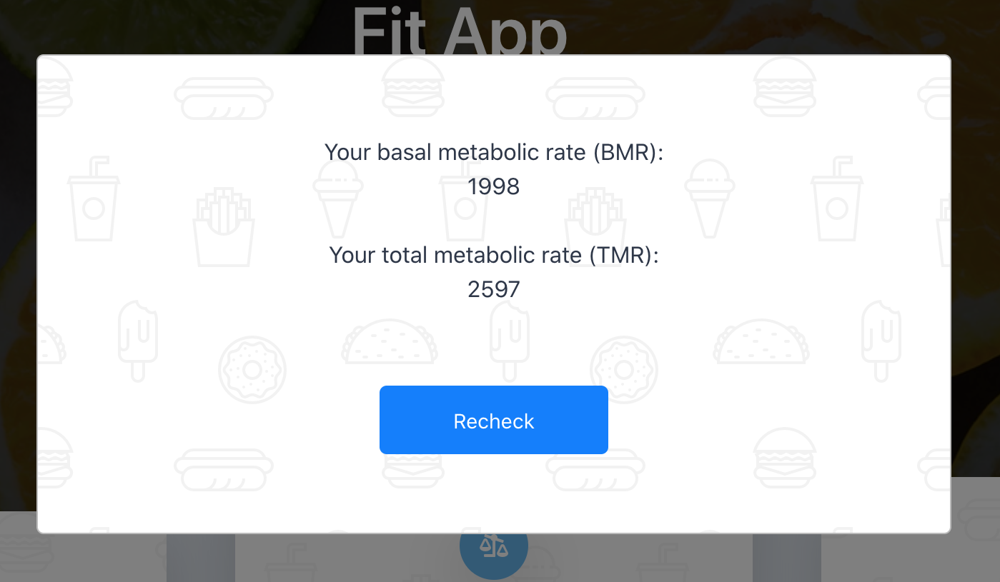

* the last component with air condition title- checking user location and giving information about today air quality

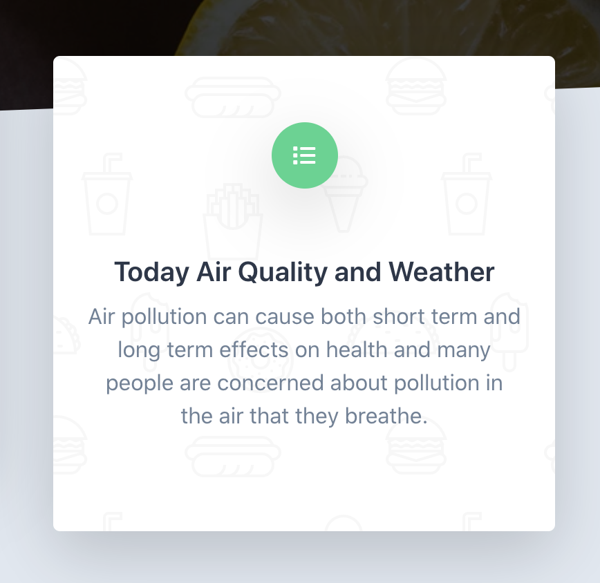
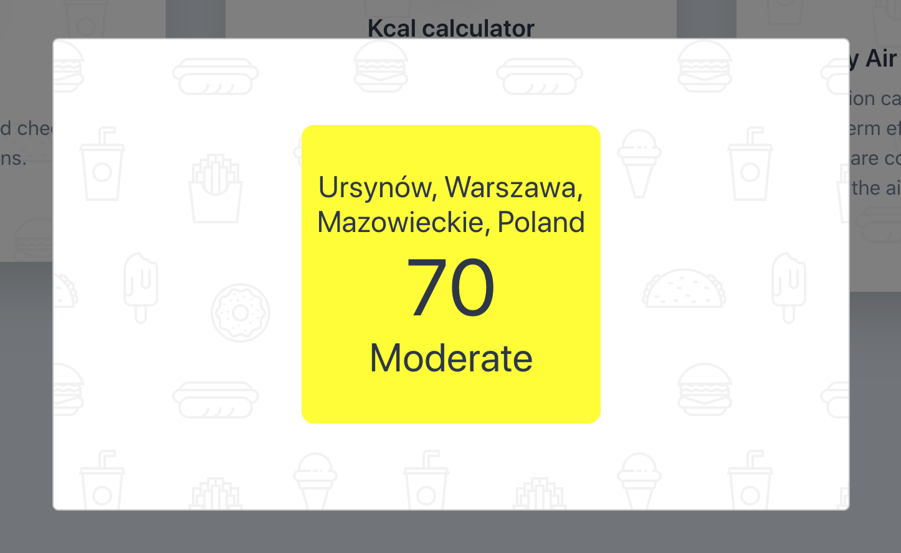

* in the bottom there is a form that is sending emails throughout EmailJS
 (please don’t use it to contact me, email was created only for website purposes and it's not checked regularly), but its working you can check the code

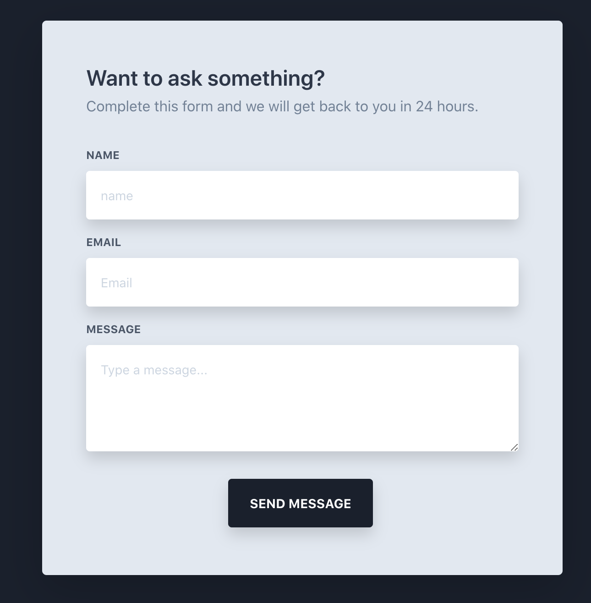

* there is Navbar- with logo that sending user back to main page and also sign and registration links
* rest of the page is example how this website can looks like, information was taken from NHS website

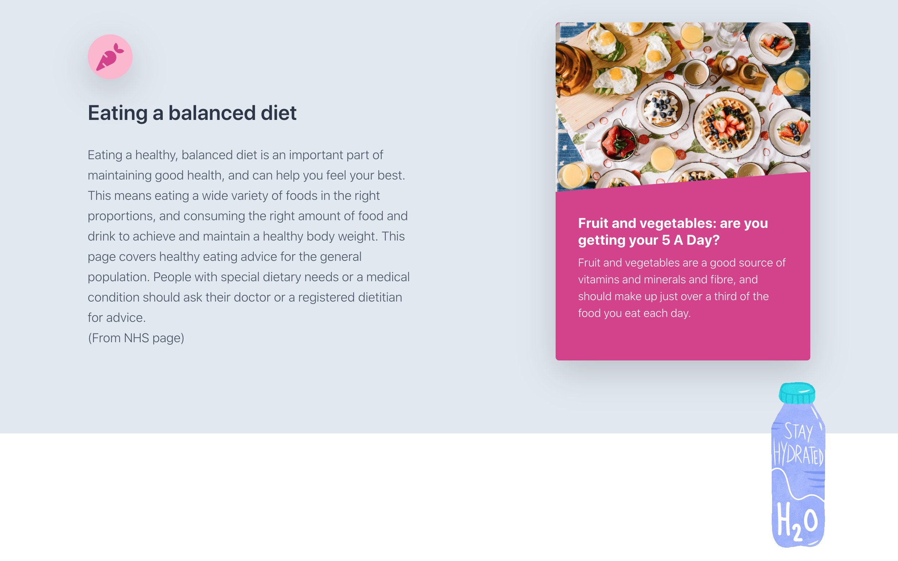
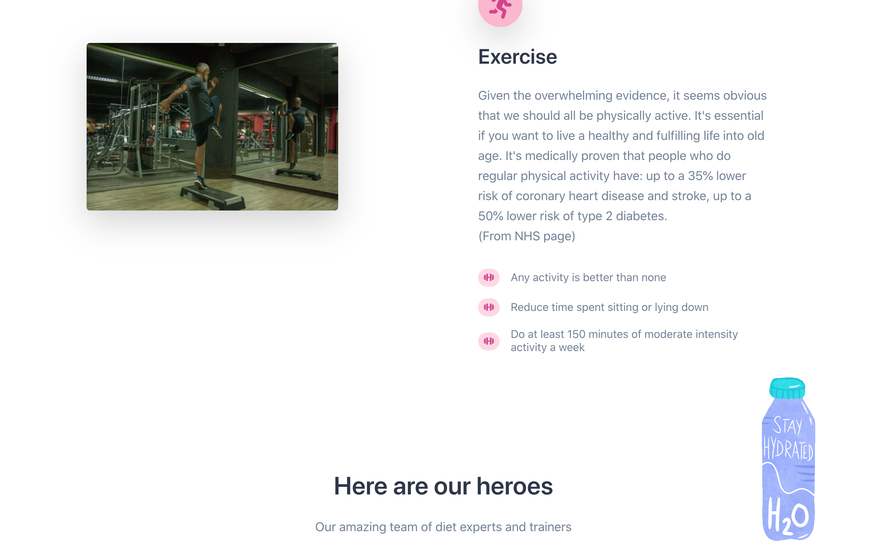
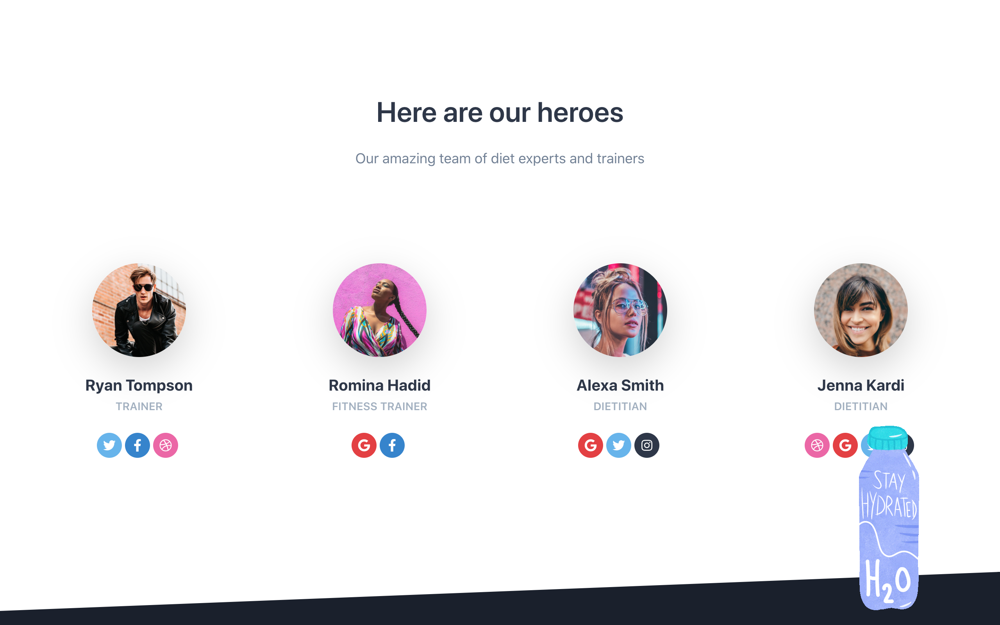

Landing page (when user is sign in) client can find:
* all of the components that were already mentioned, but after sign in the calculation (like BMI and caloric intake) are send to database, every time user log and click on this components - client can check his past results, after clicking recheck it come back to form window
* there is one more pop up for user after log in- appears after clicking on bottle - on pop up there is a button to add ”250 mls” after clicking there would be bottle appear on the screen (max 4 bottles) to achieved 2l water a day, number of bottles are also remembered and they are reset every day

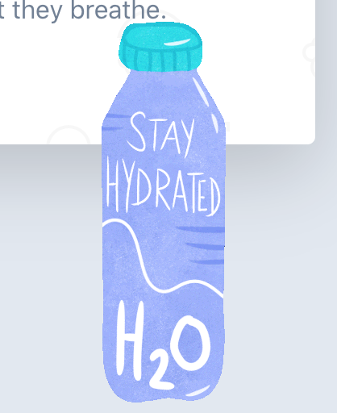
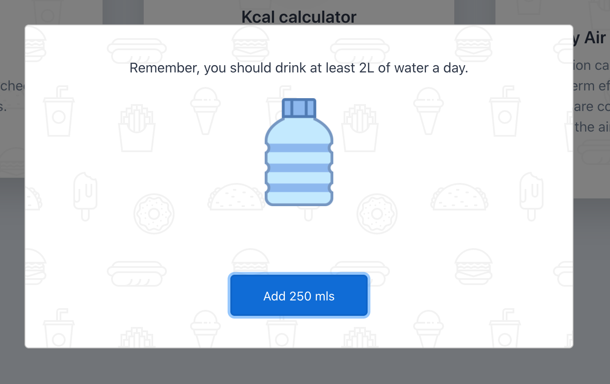

in the Navbar

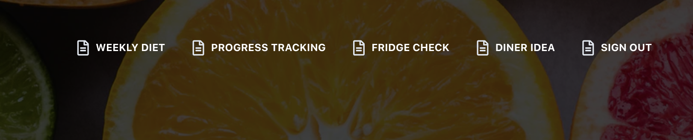

* sign out
* dinner idea - clicking this link sends user to a new page where one can get random dinner ideas. Users can also select wine pairing (unfortunately there were some changes on API and there is no wine pairing available for now)

* fridge check - in this page user can provide up to five ingredients and the application will suggest four dishes that can be prepared using the ingredients.
Instructions will be shown after clicking on the accordion

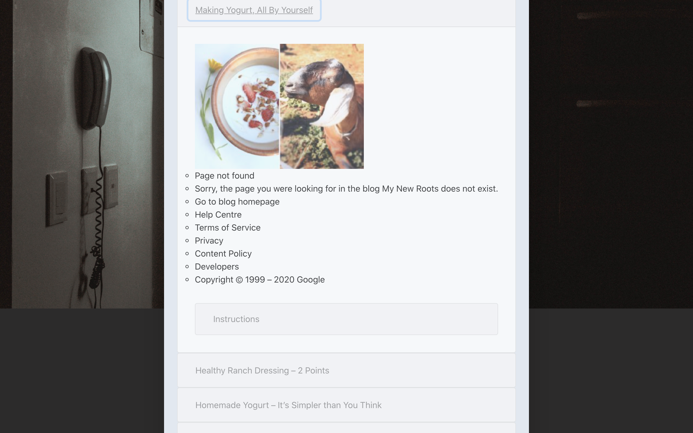

* weekly diet - after clicking this one user will get meal plan, all of meal names are also links to websites with ingredients and cooking instructions, meal plan can be printed (print mode is also available where only table is displayed)

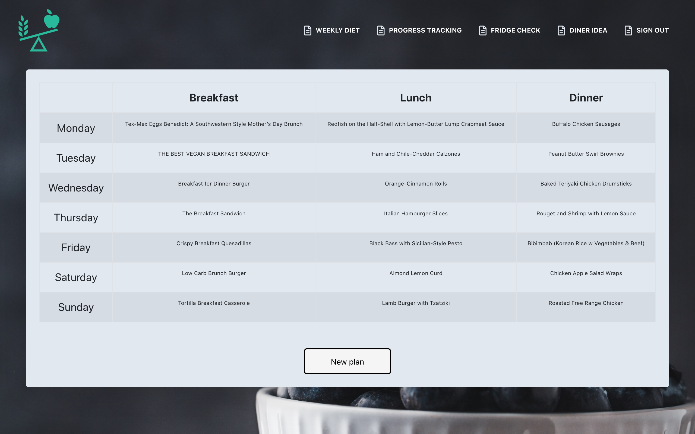

* progress tracking - user can check progress their weight loss progress.
It contains a daily chart of the weight.

There are also sign in and registration sides:
* there is special button to log in with demo user
* or just add this info: Email: `k@gmail.com`; Password: `k`

